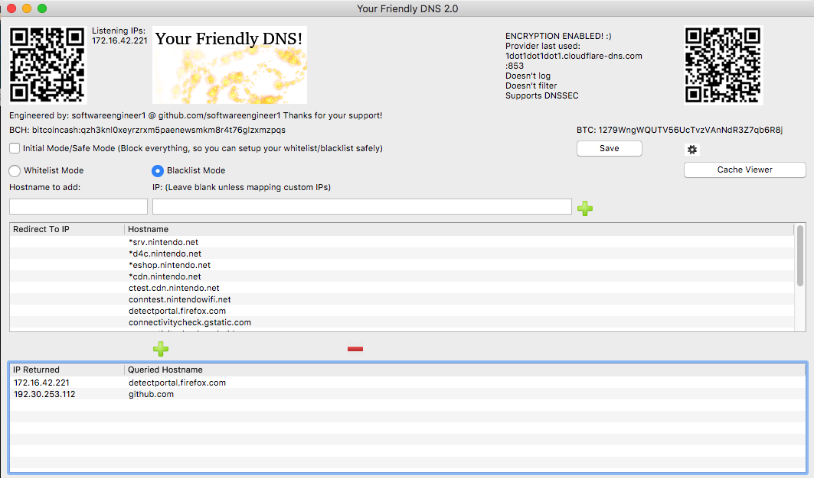
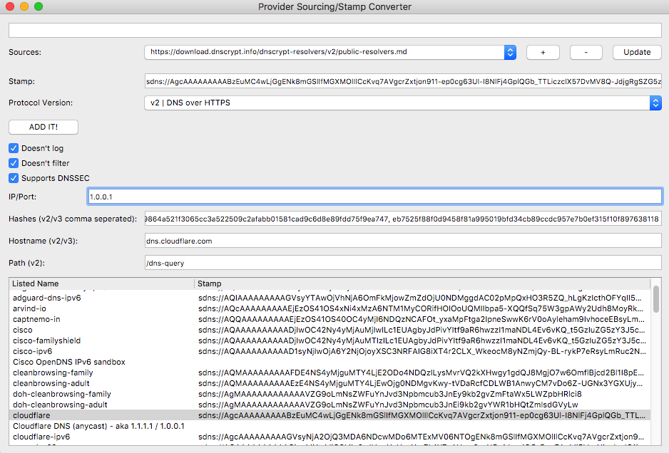

# YourFriendlyDNS
A really awesome multi-platform (lin,win,mac,android) local caching and proxying dns server!

GET LATEST VERSION HERE (v2.1.1):
https://github.com/softwareengineer1/YourFriendlyDNS/releases

{Version 2.1.3}
1. Timeout state improved (intermediary state to confirm timeout)

{Version 2.1.2}
1. Added a disconnected / no response timeout state, so if no responses are received (maybe disconnected/offline) the message queue shouldn’t drown in unhandled requests.

2. Added Auto Sourcer + Stamp Converter!
 -> Auto Sourcer, already has the main three available and known sources preloaded by default (and a source with my providers during testing, demonstrating the ease of adding or making/using your own provider sources resources), and you can easily add further sources if/when they’re available or change web locations. HTTPS (port 443) and HTTP (port 80) sources locations supported.

Much more user-friendly! Now you don’t need to manually look at provider sources and pick and choose which ones to then copy and paste one by one into the application… You can instead load (from saved once retrieved recently) or download/update source lists from their urls that are in the standard simple format, select them to decode and see what server info is actually contained, change server parameter to re-encode the server info back to stamp form and finally click “ADD IT!” button to add to your dns providers / dns servers list!

The stamp converter supports protocols v1,v2,v3 (v0 is just plain dns, it can read them but won’t use them if DNSCrypt is enabled)

3. Reduced DoH + DoTLS request handling objects into one object that handles both (they were so similar, I realized I could just make them one type)

4. Fixed some small things, noticed incorrect while adding this (like v2 or v3 stamp reading when no hashes provided, if the first hash’s length is zero just skip trying to read hashes since none were provided)

{Version 2.1.1}
1. DNS over TLS fixed and working properly now!
-> The provided hostname doesn’t necessarily resolve to the right ip to use for DoTLS. Since QSSlSocket inherits from QTcpSocket, I can therefore use connectToHost rather than connectToHostEncrypted (which doesn’t take an ip, only a hostname) and use startEncryption function manually. Using the provided IP address in the stamp if there is one now correctly connects to the DoTLS provider! Also added the 2 byte length  prefix that I forgot initially. So now both DNS over HTTPS and DNS over TLS work! :)
2. Like noted in the dnscrypt stamp specification, if there is no IP address provided or its just a port, it’ll use the hostname instead (a stamp like this should indicate the hostname will resolve to the correct ip to use) and use the port from either place it’s located. So even in that edge case it’ll still work properly!
3. Alright what else is there to do now? Perhaps have a list of DNSCrypt provider sources to auto download from (might as well since we have a TLS stack now) and let you easily select and add them not requiring manual copying and pasting anymore. Also an inbuilt stamp converter to create stamps from specified server info, or vice versa. (Like dnscrypt.info’s but also doing protocol v3 [I had to manually change the start to “sdns://Aw” (protocol version 3) in my testing of v3 servers])
4. Looking good now! :)

{Version 2.1}
1. DNS over HTTPS / DoH support added!
2. DNS over TLS / DoTLS support added!
Note: If using DoH and/or DoTLS providers you should set a dedicated v1 DNSCrypt provider to use to resolve the hosts of DoH and DoTLS providers themselves! :)
3. Props info now displayed as well for last used provider
4. Look for the new version 2.1 on the releases page shortly and checkout the new code now! :)

{Version 2.0.7}
1. Better handling of multiple DNSCrypt providers
2. Last DNSC provider used is displayed on the main window
3. PlainDNS can specify a port now too, ex. 208.67.222.222:53 (when DNSCrypt is disabled)
4. Fixed too small of a font used on macOS
 ->Now I’m truly ready to add protocolVersion 2 & 3 support

{==VERSION 2.0==} -> Major milestone!
1. DNSCrypt now supported! Very happy I made it this far!
You locally send it standard plaintext requests as usual and it transparently dnscrypts them for you using the dnscrypt providers you’ve specified.
Now your queries aren’t going over the wire as plaintext anymore! Enabled by default! No fallback (must disable DNSCrypt to use plaintext dns servers again)
2. Can enable new key pair per request otherwise a new key pair is made on every newly validated certificate for that provider.

Just add DNSCrypt stamps in settings to the list of dns servers and make sure enable DNSCrypt checkbox is checked to use them!
ex. "sdns://AQAAAAAAAAAADjIwOC42Ny4yMjAuMjIwILc1EUAgbyJdPivYItf9aR6hwzzI1maNDL4Ev6vKQ_t5GzIuZG5zY3J5cHQtY2VydC5vcGVuZG5zLmNvbQ"
Corresponds to:
Protocol version 0x0001 read -> DNSCrypt!
Provider using IPv4 address: "208.67.220.220"
Provider PubKey aquired... len: 32
Provider name: "2.dnscrypt-cert.opendns.com" len: 27

Currently protocol version 2 (DoH / DNS over HTTPS) isn’t implemented yet, so if adding them they won’t be used at the moment.
I do like how all the necessary information is all contained in the base64 encoded string, so I adopted the stamps as well. No auto sourcing them for now though, manually add them from here: https://github.com/jedisct1/dnscrypt-proxy/wiki/DNS-server-sources

3. IPv6 has been supported without me realizing it since I’ve supported every record type (not just A)! So now I’ve made it also listen on ipv6 addresses as well as ipv4 addresses so now you can not only get ipv4/ipv6 addresses connecting to the server over ipv4 but also connecting to it over ipv6 now as well. (You can set it as an ipv6 dns server)

4. Added a cache viewer

Mac + Windows + Android v2.0 builds are now available!

{Version 1.1.9}
1. Another slight reduction (adding and using getListEntry similar to when I added getCachedEntry)
2. Fixed multiple cache entries for the same domain if it was requested with changed cases -> (ex. gItHuB.com instead of github.com)
 ->Despite checking each domain with a case insensitive match with wildcard support I still inserted into the cache and checked against it an a case sensitive way.
 ->To solve it I changed this one line: “dns.domainString = fullname;” to “dns.domainString = fullname.toLower();” which is upon first interpreting the domain.
 ->Now if an altered case domain name is given (ex. “ExAMpLE.CoM” it’s always seen as “example.com”, anywhere in the application after it’s first interpreted)
3. Also fixed customized dns and http server ports not actually being used by preloading the dns and http server ports from the config file right away, and reading the other info from it later.
 -> I noticed this when setting the dns and http server ports above 1024 saving it and running it not as root and it still attempted to bind to port 53 and 80 ignoring the config (because I was reading it too late after the servers were already initialized and started)
 -> Now you can run it as non root, if you have and prefer some other way to redirect ports 53 and 80 to it (like iptables which I use on android in here [that itself still requires root though]) or if you can specify a port for your dns server on whatever device you’re using and obviously you can for http. (But it won’t really work as an auto captive portal in that case)

{Version 1.1.8}
1. Added customizable DNS TTL instead of hardcoded, or auto setting matching your cached entry minutes valid value but in seconds.
2. More cleanly exiting (freeing up objects created)

{Version 1.1.7}
1. Code reduction while keeping the same functionality and speed
2. + One small fix of a slight error made during code reduction

{Version 1.1.6}
1. Code tidying up and minor adjustments.

{Version 1.1.5}
1. Recursion flag now set, which eliminates the 'recursion requested but not available' warning from dig
2. Responding to NXDOMAIN immediately with injected ip / custom ip instead of delaying at all... (I'm interpreting NXDOMAIN response code now, to respond immediately to it)
3. Using the DNS_HEADER structure now when producing answer responses instead of manual offsets with constants
 ->1.1.5 is a beautiful version, I feel like everything is working correctly now.

{Version 1.1.4}
[Bugfix release]
1. Cache was only being triggered to be used after each second request for a certain domain, instead of after the first request.
(Ex. request github.com -> get ips for it cache them -> return response, request github.com -> get ips, cache them -> return response, request github -> return cached ips built response. (until it expires then it will do this again)
Now it will properly just do:
request github.com -> get ips for it cache them -> return response, request github -> return cached ips built response. (until it expires then it will do this again))
2. Added new blacklist default "*cdn.nintendo.net"
So yes nothing major this time, but still the cache should be working properly and now it is again!

{Version 1.1.3}
[Bugfix release]
1. Whitelist mode was broken in 1.1.2, it is now fixed and working again.
2. Instantly responding to requests was broken in 1.1.2, now it's working again too.
 ->That should be the last time anything major is broken at least until 1.2+ hopefully! :)
  ->1.1.3 is a needed update if you have 1.1.2, so make sure to upgrade to it for improved experience.

{Version 1.1.2}
[Features since 1.0]
 1. Inbuilt single file replayer http server (it just replays the same html you specify for any request)
   ->"index.html" file can be edited from the settings
   ->port of the http server can be customized, 0 is off, by default it's 80, which goes to port 8080 on android (and iptables 80 -> 8080)
   ->(port of the dns server can now be customized also, unlike it however, 0 is port 53 still :))
 2. Auto injects the servers first found listening ip by default (ip of dns and now http server) (OOB captive portal capturing)
 3. Upon loading of new version, auto blacklisting of known captive portal urls happens and it's an option in the settings
 4. Improved caching! Now caches and returns for all dns query types instead of just A records.
 [Android Specific]
 5. Event processing now moved to a background thread, allowing it to now entirely run both the dns and http server in the background on android!
   ->You can now minimize it, and it will stay working in the background (no longer depending on gui being visible). As long as the app stays running it'll stay working!
   ->Even though I'm creating some threads it's still ansynchronous. Those threads are to process the ansynchronous events, seperate from the main thread.
 6. Gui looks better on android and is more readable
 7. Now only inserts the iptables forwarding once, so it doesn't just keep inserting the same thing every new running instance into iptables
 8. Runs those iptables inserting with su privileges in it's own thread as well so it also doesn't block the main thread either.
[Bugfixes since 1.0]
 9. Crash on no ip addresses at all received from real dns server for A record
   (What it does now instead of crashing is a delayed not able to load, and then it redirects to the injected ip / server ip / custom ip)
 10. Don't allow blank entries in either lists or dns server box
 11. Improved handling of other dns types and of A records themselves too 

Okay the directions for using with the switch or other use:

Two options:
[One]
To ensure you have the latest version you may want to compile it yourself for your desired platform (Either Linux, Mac, Windows, or Android) [iOS if you're jailbroken and feeling adventurous and know an iptables alternative, For Android your device must be rooted as well]

1. Download and install the free software license (non commercial) version of Qt version 5.10 or later
2. Download the source of the project which contains the .pro file(project file) that opens in Qt
3. Open it in Qt and configure it to be built for your platform (for android must have android sdk and ndk installed for linux,windows,mac it'll automatically let you load it)
(Optional: build the latest stable libsodium libraries for the platforms you’re building for, or you’ll be using my compiled ones of 1.0.16 for each platform I’ve built it for)
4. Do a Ctrl+B or Command+B to build the project! :D Done! Ready to run ->

[Two]
1. Download the whole project (git clone or download zip) and browse to the folder of your platform (Linux-x64 for linux, Mac-x64 for mac, etc...)
2. Copy the entire folder with all the supporting shared libraries to some location you like :D Done! Ready to run ->

Note: On Linux/Mac/Android It needs to be run as root, so it can bind and listen on udp port 53, and http port 80 that's the only reason it requires it.
On windows I discovered it doesn’t need to be run as administrator/root you just have to accept the popup so it’s not blocked in windows firewall.
Also if you run it once and set the port to higher than 1024 that’s another way you can run it without being root (they won’t be on the default dns and http ports, but the servers will actually be running at least on your specified ports)

Now how to run it :
[Linux]
1. Browse to the directory containing it, right click and choose open terminal at this location.
2. Type sudo ./YourFriendlyDNS and enter your password for your user account (must have sudoer privileges or change to a user that does or to root user)
3. Configure it how you like and use an IP displayed on the GUI "Listening IPs: " text label as your DNS server from any device locally connected to the same network as you're running he DNS server on!

[Mac]
1. Browse to the directory containing it, open a terminal, and drag LaunchYourFriendlyDNSAsRoot.sh onto the terminal window.
2. Enter your password so it's granted root access
3. Configure it how you like and use an IP displayed on the GUI "Listening IPs: " text label as your DNS server from any device locally connected to the same network as you're running he DNS server on!

[Windows]
1. Browse to the directory containing it, and right click YourFriendlyDNS.exe and choose Run As Administrator
2. Okay the privilege escalation box, if it appears, so it''s granted Administrator/root access
3. Configure it how you like and use an IP displayed on the GUI "Listening IPs: " text label as your DNS server from any device locally connected to the same network as you're running he DNS server on!

[Android] (Make sure your device is actually rooted and you can run su with no issues and actually truly do have root)
1. Copy and install the apk to your device, use the one for your Android architecture, either ARM or x86. (You may need to enable installing packages from unknown sources if you haven't already)
2. Run the app and when the su root access prompt is displayed hit accept (you only have to do this once, unless you remove it's priviliges from your su app later)
3. Configure it how you like and use an IP displayed on the GUI "Listening IPs: " text label as your DNS server from any device locally connected to the same network as you're running he DNS server on!
[Note: For Android currently the application's GUI has to stay open and visible for DNS requests and responses to be handled, I'm going to fix this but right now I recommend setting your device to not ever sleep / turn off screen and keep it plugged it or be sure to plug it in when it's low so that your YourFriendlyDNS will remain working on your Android. For Devs: Is there a way I can keep it asynchronous while also running those asynchronous dns handlings from that separate thread from the gui/main thread? Make if I first create a new thread and then connect the signals from that thread instead of from the main thread it'll stay working even when backgrounded (as long as the app remains running) I'll look into it!]

[Usage]
Make sure to take it off of 'Initial Mode/Safe Mode' by unchecking that checkbox once you've configured your whitelist/blacklist and it's safe to do so (whitelist is safe immediately, blacklist should be safe immediately as long as those nintendo update servers have stayed the same)

1. Select Whitelist or Blacklist mode
2. Add domain names to whitelist or blacklist, * wildcards are supported, for example: "*gbatemp.net" matches www.gbatemp.net, gbatemp.net, or anything.anything.gbatemp.net
-> If in whitelist mode, a matched domain that's in the whitelist will be accessible, everything else will not be.
-> If in blacklist mode, a matched domain that's in the blacklist won't be accessible, everything else will be.
-> Things that aren't accessible/are blocked will be directed to 127.0.0.1/localhost by default, unless you have a server on that machine on the port for the service you're accessing (ex. trying to access filtereddomain.domain on a device with this dns server configured on a web browser will redirect to http://127.0.0.1 relative to that device the dns is configured to be used on (so that device itself)). You can change this is the settings so it goes to for example another computer on your local network instead.
-> If you add a hostname/domain and also fill in the custom mapping IP field, the IP in the settings is ignored and the mapped IP is returned for domains that match instead. That also changes the behavior of that item in the list and treats it as a special case, to just return that IP instead of any other (can be use in either whitelist/blacklist mode).
3. Change the settings to keep the cached IPs (for whitelisted/non blacklisted domains) treated as valid for longer or shorter (note: too long and your ips might get stale). The cache not kept between instances of the application (eg. If you restart it, it start's fresh.) You can also clear it forcefully at anytime by hitting the "Clear Cache Now" button. Also you can change the real dns servers to use, by default it uses open dns servers. You can add as many as you like and it randomly selects which one to use each time a request needs to be made.

4. Now you are running your own local caching and proxying dns server! You no longer have to worry about an online one going down, or not working properly, because you can always make sure your locally running one is working because you control when it runs and how it's configured!

Source:
https://github.com/softwareengineer1/YourFriendlyDNS/tree/master/Source/YourFriendlyDNS

Linux Version:
https://github.com/softwareengineer1/YourFriendlyDNS/tree/master/Linux-x64

Mac Version:
https://github.com/softwareengineer1/YourFriendlyDNS/tree/master/Mac-x64

Windows:
https://github.com/softwareengineer1/YourFriendlyDNS/tree/master/Windows-x64

Android ARM:
https://github.com/softwareengineer1/YourFriendlyDNS/tree/master/Android-armeabi-v7a

Android x86:
https://github.com/softwareengineer1/YourFriendlyDNS/tree/master/Android-x86

